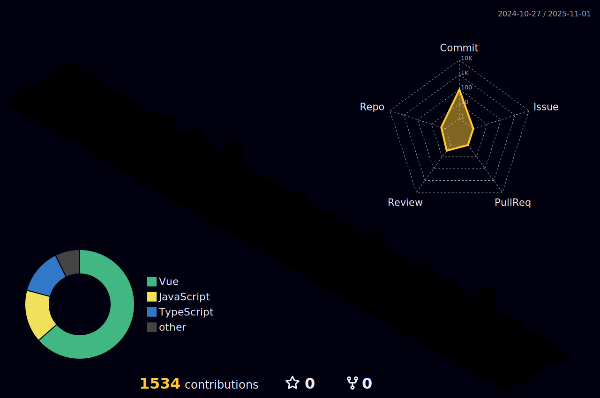

<h1>Matheus G. Pereira</h1>

  

 

|  |  |
| ----------- | ----------- |

 

## 💻 Linguagens de Programação

  

## 🚀 Frontend

  <h3>Frameworks & Bibliotecas</h3>
  
  
  <h3>Estilização & UI</h3>
  
  
  <h3>Ferramentas & Utilitários</h3>
  

## 🧠 Backend

  <h3>Frameworks & Runtime</h3>
  
  
  <h3>Bancos de Dados & ORM</h3>
  

## ⚙️ DevOps & Infraestrutura

  <h3>Containerização & Orquestração</h3>
  
  
  <h3>CI/CD & Automação</h3>
  
  
  <h3>Servidores & Sistemas</h3>
  

## 🧪 Testes & Qualidade

  

## 🔧 Ferramentas de Desenvolvimento

  <h3>Editores & Controle de Versão</h3>
  
  
  <h3>Gerenciadores de Pacotes</h3>
  
  
  <h3>Utilitários</h3>
  

## 🌐 Redes Sociais

  
  
  

 

## 🏆 Trophies

  

